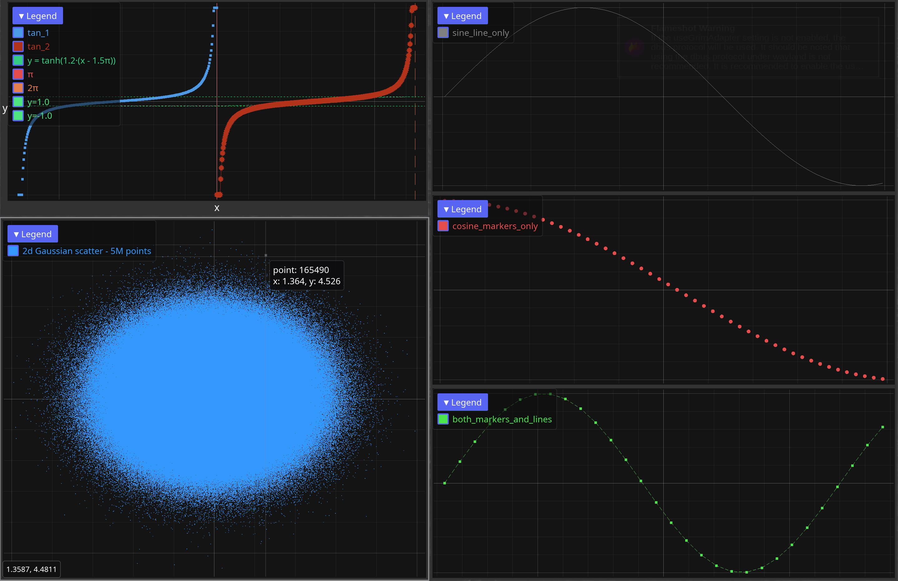

[](https://crates.io/crates/iced_plot)
[](https://docs.rs/iced_plot)

A batteries-included GPU-accelerated plotting widget for Iced.

## Features

- Works with large datasets (up to millions of points)
- Retains GPU buffers between frames for fast redraws and picking
- Axes/labels, legends, reference lines, tooltips, crosshairs, axis linking, etc.

## Quick start

```rust
use iced_plot::{Color, PlotWidgetBuilder, Series};

let series = Series::circles((0..100).map(|i| [i as f64, i as f64]).collect(), 2.0)
    .with_color(Color::from_rgb(0.2, 0.6, 1.0))
    .with_label("points");

PlotWidgetBuilder::new()
    .with_x_label("x")
    .with_y_label("y")
    .add_series(series)
    .build()
    .unwrap();
```

See the `examples/` directory for more.



## Wasm support

Iced plot works in WebGPU-enabled browsers. The examples can be served with [trunk](https://trunkrs.dev/):

```
$ trunk serve examples/index.html --example custom_ticks
```
